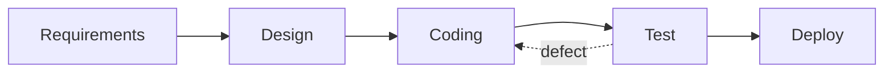
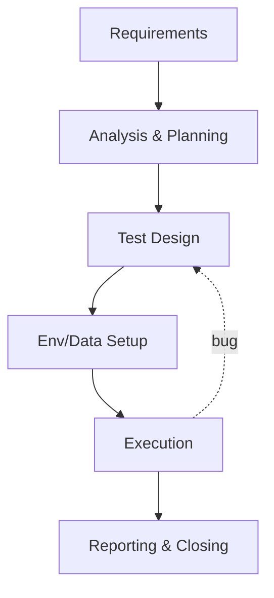

# Module 01: QA Overview

## 1.1 The QA Analyst Role

The QA Analyst (Quality Assurance) is the professional responsible for ensuring software **meets** requirements and customer expectations, **proactively**—not just finding defects after development.

> **Note**: QA ≠ Testing. QA is the quality *assurance* process (focus on process); Testing is the technical *verification* activity (focus on product). See [1.3](#13-qa-vs-qc-vs-testing).

### Main Responsibilities
- **Prevention**: participate in requirements elaboration, documentation reviews, and test planning to prevent defects
- **Detection**: execute functional and non-functional tests to find defects before delivery
- **Communication**: act as the bridge between business, development, and stakeholders
- **Continuous Improvement**: identify defect patterns and propose process improvements

### Recommended Profile
- Critical and objective vision
- Good written and verbal communication skills
- Curiosity to understand *how* and *why* the system works
- Organization and documentation ability
- Empathy with end users and the development team

## 1.2 QA Scope of Work

### Functional Testing
- Unit, integration, system tests
- Smoke, sanity, regression tests
- Acceptance tests (UAT)

### Non-Functional Testing
- **Performance**: load, stress, endurance, spike
- **Security**: vulnerabilities, penetration testing
- **Usability**: real users, heuristics (Nielsen)
- **Compatibility**: browsers, devices, operating systems
- **Reliability / Availability**

### Other Test Types
- **Exploratory**: without script, based on tester creativity (see Module 04)
- **BDD**: user behavior via Given/When/Then (see Module 09)
- **Alpha/Beta**: controlled environment (alpha) or real users (beta)

## 1.3 QA vs QC vs Testing

Common confusion. Definitions (ISO 9000 / ISTQB):

| Term | Focus | Question |
|------|-------|----------|
| **QA (Quality Assurance)** | Process | "Are we doing it right?" |
| **QC (Quality Control)** | Product | "Is the product right?" |
| **Testing** | Technical activity | "Where are the defects?" |

Summary: **QA** prevents, **QC** detects in the product, **Testing** is the technique used in QC.

## 1.4 The 7 Testing Principles (ISTQB)

These principles guide the whole profession:

1. **Testing shows the presence of defects, not their absence** — we never prove software is bug-free.
2. **Exhaustive testing is impossible** — use risk analysis to prioritize.
3. **Early testing saves time and money** — the earlier a defect is found, the cheaper to fix (see Cost of Quality).
4. **Defects cluster together** (*defect clustering*) — few modules hold most bugs.
5. **Tests wear out** (*pesticide paradox*) — review and diversify test cases.
6. **Testing is context dependent** — what works for medical software may not for e-commerce.
7. **Absence-of-errors fallacy** — defect-free software can still fail to serve the user.

## 1.5 Cost of Quality

Splitting cost into 4 categories helps justify QA investment:

| Category | Example |
|----------|---------|
| **Prevention** | training, reviews, planning |
| **Appraisal** | test execution, inspections |
| **Internal failure** | bug found before delivery (rework) |
| **External failure** | bug in production (SLA, recall, reputation) |

Golden rule: **investing in prevention reduces external failures**, the most expensive ones (sometimes 100× the cost of fixing at requirements stage).

## 1.6 Certifications and References

### International
- **ISTQB Foundation Level** — most recognized worldwide
- **ASTQB / ISTQB Advanced** (Test Manager, Test Analyst)
- **CSQE** — Certified Software Quality Engineer (ASQ)
- **CAST** — Certified Associate in Software Testing (QAI)

### Standards
- **IEEE 829** (historical) — test documentation
- **ISO/IEC 25010** — product quality model (replaces ISO 9126)
- **ISO 9001** — quality management systems
- **CMMI** — process maturity
- **ISO/IEC/IEEE 29119** — test processes

### Brazil
- **ASTFC-AICS** — Brazilian Software Testing Analyst certification
- **PROTESTE / MCTI** — quality programs
- Communities: **QAXperience**, **Jornada Ágil**, **TDC**

## 1.7 Methodologies and the QA Role

### Agile
- **Scrum**: PO, Scrum Master, Dev Team. QA joins Planning (estimation), Daily, Review, Retro.
- **Kanban**: WIP limits, lead/cycle time, continuous flow.
- **XP**: pair programming, TDD, CI.

### Traditional
- **Waterfall**: sequential phases, testing at the end.
- **V-Model**: each dev phase has a mirrored test phase.
- **Spiral**: risk-oriented iterations.

## 1.8 Software Test Life Cycle (STLC)

## 1.9 Common Tools

- **Management**: Jira + Xray / TestRail / TestLink
- **Automation**: Playwright (recommended), Cypress, Selenium, Pytest, Jest
- **API**: Postman/Newman, requests, Schemathesis
- **Performance**: k6, Locust, JMeter
- **Reporting**: Allure, pytest-html

## 1.10 Career and Compensation

### Levels
- **Junior (0–2y)**: test execution, manual
- **Mid (2–5y)**: basic automation, planning
- **Senior (5y+)**: technical leadership, strategy
- **Lead/Manager**: quality policy, people management

### Ranges (Brazil — 2025 reference, approximate)
- Junior: R$ 3,500–R$ 7,000
- Mid: R$ 7,000–R$ 13,000
- Senior: R$ 13,000–R$ 22,000
- Lead/Manager: R$ 20,000+

> *Estimated and regional values; consult current salary surveys (Glassdoor, GeekHunter, Catho).*

> *"Quality is never an accident. It is always the result of intelligent effort."* — **John Ruskin**

## 1.11 Next Steps

At the end of this module, the reader should be able to:
1. Distinguish QA, QC, and Testing
2. Explain the 7 ISTQB testing principles
3. Apply the Cost of Quality concept
4. Position QA in Scrum/Kanban/Waterfall
5. Describe the STLC and its phases

---

> **Next module**: [Module 02: Software Quality Fundamentals](02/EN/index.md)
