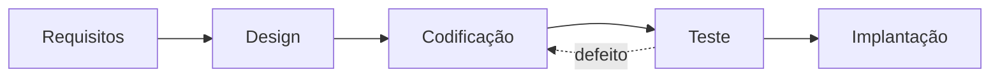
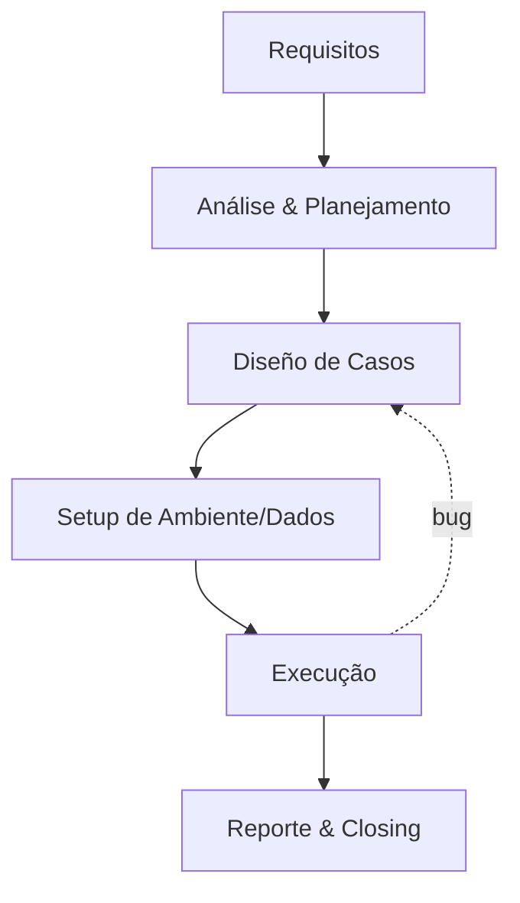

# Módulo 01: Visão Geral do QA

## 1.1 Quem é o Analista de Testes / QA

O Analista de Testes (ou QA — *Quality Assurance*) é o profissional responsável por garantir que o software **atenda** aos requisitos e expectativas do cliente, de forma **preventiva**, e não apenas encontrando defeitos após o desenvolvimento.

> **Importante**: QA ≠ Teste. QA é o processo de garantia da qualidade (foco no processo); o Teste é a atividade técnica de verificação (foco no produto). Veja a seção [1.3](#13-qa-vs-qc-vs-teste).

### Atribuições principais
- **Prevenção**: participar da elaboração de requisitos, reviews de documentação e planejamento para evitar defeitos
- **Detecção**: executar testes funcionais e não funcionais para encontrar defeitos antes da entrega
- **Comunicação**: atuar como elo entre negócio, desenvolvimento e stakeholders
- **Melhoria Contínua**: identificar padrões de defeitos e propor melhorias de processo

### Perfil recomendado
- Visão crítica e objetiva
- Boas habilidades de comunicação escrita e oral
- Curiosidade para entender *como* e *por que* o sistema funciona
- Organização e capacidade de documentação
- Empatia com usuários finais e com a equipe de desenvolvimento

## 1.2 Campo de Atuação do QA

### Testes Funcionais
- Unidade, integração, sistema
- Smoke, sanity, regressão
- Aceitação (UAT)

### Testes Não Funcionais
- **Performance**: carga, estresse, resistência, pico
- **Segurança**: vulnerabilidades, penetration test
- **Usabilidade**: usuários reais, heurísticas (Nielsen)
- **Compatibilidade**: navegadores, dispositivos, SOs
- **Confiabilidade / Disponibilidade**

### Outros tipos
- **Exploratório**: sem script, baseado na criatividade do tester (ver Módulo 04)
- **BDD**: comportamento do usuário via Given/When/Then (ver Módulo 09)
- **Alpha/Beta**: ambiente controlado (alpha) ou com usuários reais (beta)

## 1.3 QA vs QC vs Teste

Confusão comum. Definições (ISO 9000 / ISTQB):

| Termo | Foco | Pergunta |
|-------|------|----------|
| **QA (Quality Assurance)** | Processo | "Estamos fazendo da maneira certa?" |
| **QC (Quality Control)** | Produto | "O produto está certo?" |
| **Teste** | Atividade técnica | "Onde estão os defeitos?" |

Resumo: **QA** previne, **QC** detecta no produto, **Teste** é a técnica usada no QC.

## 1.4 Os 7 Princípios de Teste (ISTQB)

Estes princípios orientam toda a profissão:

1. **Teste mostra a presença de defeitos, não sua ausência** — não provemos que o software está livre de erros.
2. **Teste exaustivo é impossível** — use análise de risco para priorizar.
3. **Teste precoce economiza tempo e dinheiro** — quanto antes o defeito é achado, mais barato corrigir (ver Custo da Qualidade).
4. **Defeitos se concentram** (*defect clustering*) — poucos módulos concentram a maioria dos bugs.
5. **Testes envelhecem** (*pesticide paradox*) — reveja e diversifique casos de teste.
6. **Teste é dependente do contexto** — o que vale para médico não vale para e-commerce.
7. **Falácia da ausência de erros** — software sem defeitos pode ainda não servir ao usuário.

## 1.5 Custo da Qualidade (Cost of Quality)

Dividir o custo em 4 categorias ajuda a justificar investimento em QA:

| Categoria | Exemplo |
|-----------|---------|
| **Prevenção** | treinamento, reviews, planejamento |
| **Avaliação (Appraisal)** | execução de testes, inspeções |
| **Falha interna** | bug achado antes da entrega (retrabalho) |
| **Falha externa** | bug em produção (SLA, recall, reputação) |

Regra de ouro: **investir em prevenção reduz falhas externas**, que são as mais caras (às vezes 100× o custo de corrigir na fase de requisito).

## 1.6 Certificações e Referências

### Internacionais
- **ISTQB Foundation Level** — a mais reconhecida mundialmente
- **ASTQB / ISTQB Advanced** (Test Manager, Test Analyst)
- **CSQE** — Certified Software Quality Engineer (ASQ)
- **CAST** — Certified Associate in Software Testing (QAI)

### Padrões e Normas
- **IEEE 829** (histórico) — documentação de teste
- **ISO/IEC 25010** — modelo de qualidade de produto (substitui ISO 9126)
- **ISO 9001** — gestão da qualidade organizacional
- **CMMI** — maturidade de processo
- **ISO/IEC/IEEE 29119** — processos de teste

### Brasil
- **ASTFC-AICS** — certificação brasileira de Analista de Testes
- **PROTESTE / MCTI** — programas de qualidade
- Comunidades: **QAXperience**, **Jornada Ágil**, **TDC**

## 1.7 Metodologias e o Papel do QA

### Agile
- **Scrum**: PO, Scrum Master, Dev Team. QA participa de Planning (estimativa), Daily, Review, Retro.
- **Kanban**: WIP limits, lead/cycle time, fluxo contínuo.
- **XP**: pair programming, TDD, CI.

### Tradicionais
- **Cascata**: fases sequenciais, testes ao final.
- **V-Model**: cada fase de desenvolvimento tem fase de teste espelhada.
- **Espiral**: iterações orientadas a risco.

## 1.8 O Ciclo de Vida de Teste (STLC)

## 1.9 Ferramentas Comuns

- **Gestão**: Jira + Xray / TestRail / TestLink
- **Automação**: Playwright (recomendado), Cypress, Selenium, Pytest, Jest
- **API**: Postman/Newman, requests, Schemathesis
- **Performance**: k6, Locust, JMeter
- **Relatórios**: Allure, pytest-html

## 1.10 Carreira e Remuneração

### Níveis
- **Júnior (0–2a)**: execução de testes, manuais
- **Pleno (2–5a)**: automação básica, planejamento
- **Sênior (5a+)**: liderança técnica, estratégia
- **Lead/Manager**: política de qualidade, gestão de pessoas

### Faixas (Brasil — referência 2025, valores aproximados)
- Júnior: R$ 3.500–R$ 7.000
- Pleno: R$ 7.000–R$ 13.000
- Sênior: R$ 13.000–R$ 22.000
- Lead/Manager: R$ 20.000+

> *Valores estimados e regionais; consultar pesquisas de salário atuais (ex: Glassdoor, GeekHunter, Catho).*

> *"Quality is never an accident. It is always the result of intelligent effort."* — **John Ruskin**

## 1.11 Próximos Passos

Ao final deste módulo, o leitor deverá:
1. Distinguir QA, QC e Teste
2. Explicar os 7 princípios de teste (ISTQB)
3. Aplicar o conceito de Custo da Qualidade
4. Posicionar o QA em Scrum/Kanban/Cascata
5. Descrever o STLC e suas fases

---

> **Próximo módulo**: [Módulo 02: Fundamentais da Qualidade](02/PT/indice.md)
