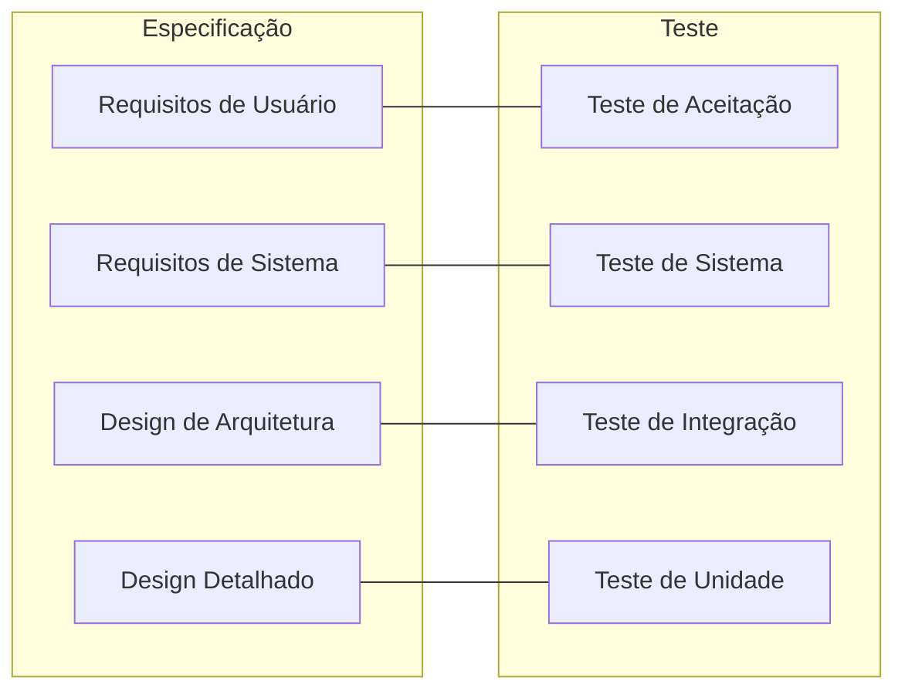

# Módulo 02: Fundamentais da Qualidade de Software

## 2.1 O que é Qualidade de Software?

Qualidade de software não é apenas "ausência de bugs". Segundo a norma **ISO 9000**, qualidade é "o grau em que um conjunto de características inerentes atende a requisitos". Para software, isso significa atender tanto aos requisitos funcionais (o que o sistema deve fazer) quanto aos não funcionais (como ele deve se comportar).

### Perspectivas de Qualidade
- **Conformidade (Conformance)**: atende às especificações documentadas
- **Fitness for Use**: atende às necessidades reais do usuário
- **Process Quality**: a qualidade do processo de desenvolvimento (que leva à qualidade do produto — princípio de **Deming**)

> *"You cannot inspect quality into a product. If it isn't already there, it's too late."* — **Harold Dodge**

## 2.2 Modelos de Qualidade

### ISO/IEC 25010 (substitui a ISO 9126)
Modelo de qualidade de produto de software com 8 características:
1. **Adequação Funcional** (completude, correção, adequação)
2. **Eficiência de Desempenho** (comportamento temporal, uso de recursos, capacidade)
3. **Compatibilidade** (coexistência, interoperabilidade)
4. **Usabilidade** (reconhecimento de adequação, aprendizado, operabilidade, proteção contra erro do usuário, estética da UI, acessibilidade)
5. **Confiabilidade** (maturidade, disponibilidade, tolerância a falhas, recuperabilidade)
6. **Segurança** (confidencialidade, integridade, irretratabilidade, autenticidade, responsabilidade)
7. **Manutenibilidade** (modularidade, reusabilidade, analisabilidade, modificabilidade, testabilidade)
8. **Portabilidade** (adaptabilidade, instalabilidade, substituibilidade)

### Boehm (1976) — Modelo Hierárquico
Primeiro modelo de qualidade, estruturado como uma árvore:
- **Utility** (utilidade) e **Maintainability** (manutenibilidade) no topo
- Ramificado em: portabilidade, confiabilidade, eficiência, testabilidade, etc.

### McCall (1977) — Modelo de Qualidade de Produto
11 fatores agrupados em 3 perspectivas:
- **Product Operation** (correção, confiabilidade, eficiência, integridade, usabilidade)
- **Product Revision** (manutenibilidade, testabilidade, flexibilidade)
- **Product Transition** (portabilidade, reusabilidade, interoperabilidade)

## 2.3 Princípios de Teste (ISTQB)

> Os 7 princípios são detalhados no **Módulo 01 (seção 1.4)**. Aqui estão resumidos para referência neste módulo de fundamentos:

1. **Teste demonstra a presença de defeitos, não sua ausência**
2. **Teste exaustivo é impossível** — use análise de risco para priorizar
3. **Teste antecipado** — quanto antes o defeito é encontrado, mais barato é corrigi-lo
4. **Agrupamento de defeitos (Pareto)** — poucos módulos concentram a maioria dos bugs
5. **Paradoxo do pesticida** — revisite e diversifique os casos de teste
6. **Teste depende do contexto** — crítico (médico) ≠ blog
7. **Ilusão da ausência de erros** — software sem bugs pode ainda não servir ao usuário

## 2.4 Níveis de Teste

| Nível | Objetivo | Responsável | Ambiente |
|-------|----------|------------|----------|
| **Unidade** | validar menor parte testável | Desenvolvedor | Dev local |
| **Integração** | interfaces entre módulos | Desenvolvedor/QA | Dev/CI |
| **Sistema** | comportamento completo do sistema | QA | Homologação |
| **Aceitação (UAT)** | atende ao negócio | Cliente/PO | Pré-produção |

### Testes de Manutenção
- **Smoke test**: validação superficial "o sistema não quebrou?"
- **Regression test**: garante que mudanças não quebraram funcionalidades existentes

## 2.5 Modelo V (V-Model)

O V-Model liga cada fase de definição (esquerda) a uma fase de teste (direita). Cada nível de especificação tem seu correspondente de verificação; o **teste antecipado** é central aqui.

## 2.6 Testes Baseados em Risco (Risk-Based Testing)

Priorizar testes pelo **impacto** (severidade se falhar) × **probabilidade** (chance de falhar).

| Impacto \ Probabilidade | Baixa | Média | Alta |
|--------------------------|-------|-------|------|
| **Alto** | Médio | Alto | **Crítico** |
| **Médio** | Baixo | Médio | Alto |
| **Baixo** | Baixo | Baixo | Médio |

**Matriz de priorização**: testar primeiro o quadrante Crítico (alto impacto, alta probabilidade).

> Exemplo prático: no e-commerce, o fluxo de "finalizar compra" tem alto impacto (receita) e alta probabilidade (complexo) → prioridade máxima.

## 2.7 Matriz de Rastreabilidade (Requirements ↔ Tests)

Garante que cada requisito tenha pelo menos um teste e vice-versa (evita "teste órfão" e "requisito sem cobertura").

| ID Req | Requisito | ID Teste | Status | Resultado |
|--------|-----------|----------|--------|-----------|
| REQ-01 | Login com e-mail válido | TC-101, TC-102 | Done | Pass |
| REQ-02 | Bloquear 3 tentativas | TC-103 | Done | Pass |
| REQ-03 | Recuperação de senha | TC-104 | To Do | — |

Ferramentas: Jira + Xray, TestRail, Planilhas.

## 2.8 Tipos de Teste x Modelo ISO 25010

| Característica ISO 25010 | Tipo de Teste Relacionado |
|--------------------------|---------------------------|
| Adequação Funcional | Testes Funcionais |
| Eficiência de Desempenho | Testes de Performance/Carga |
| Usabilidade | Testes de Usabilidade/Heurísticas |
| Confiabilidade | Testes de Estabilidade |
| Segurança | Testes de Segurança (pentest) |
| Compatibilidade | Testes de Compatibilidade |
| Manutenibilidade | Testes de Mutação, Revisões |
| Portabilidade | Testes de Instalação/Migração |

### 2.8.1 Exemplo prático: cenário de atributo de qualidade (SEI)

Atributos de qualidade (ISO 25010) só são úteis se **mensuráveis**. Use o formato *estímulo → resposta* (SEI):

**Cenário de Eficiência de Desempenho**
- **Fonte**: 500 usuários simultâneos (pico de Black Friday)
- **Estímulo**: envio de requisição de checkout
- **Ambiente**: produção, 4 réplicas
- **Resposta**: 95% das requisições respondem em **< 800 ms**
- **Medida**: p95 < 800 ms com error rate < 1% (ver Módulo 07)

**Cenário de Confiabilidade**
- **Estímulo**: falha de 1 réplica
- **Resposta**: traffico redirecionado, zero downtime
- **Medida**: disponibilidade ≥ 99,9% (três noves)

> Regra: todo requisito não funcional deve ter um **número**; senão, é opinião, não requisito.

## 2.9 O Ciclo de Vida de Teste (ISTQB)

1. **Planejamento e Controle**
2. **Análise e Design**
3. **Implementação e Execução**
4. **Avaliação de Critérios de Saída**
5. **Fechamento de Atividades**

## 2.10 Citações e Referências

- **ISO/IEC 25010:2023** — Systems and software engineering — Systems and software Quality Requirements and Evaluation (SQuaRE)
- **ISO/IEC/IEEE 29119** — Software Testing standard (international)
- **ISTQB® Glossary of Testing Terms** (v4.0)
- **Boehm, B. (1976)** — "Software Engineering" — primeira taxonomia de qualidade
- **McCall, J. (1977)** — "Factors in Software Quality" (RADC)
- **Myers, G. (1979)** — "The Art of Software Testing" — princípios de teste
- **Deming, W. E.** — "Out of the Crisis" — qualidade de processo

---

## 2.11 Próximos Passos

Ao final deste módulo, o leitor deverá:
1. Explicar qualidade sob as perspectivas de conformidade e fitness-for-use
2. Listar as 8 características da ISO 25010
3. Aplicar os 7 princípios de teste do ISTQB
4. Construir uma matriz de rastreabilidade simples
5. Priorizar testes usando a matriz de risco

---

> **Próximo módulo**: [Módulo 03: Planejamento de Testes](03/PT/indice.md)