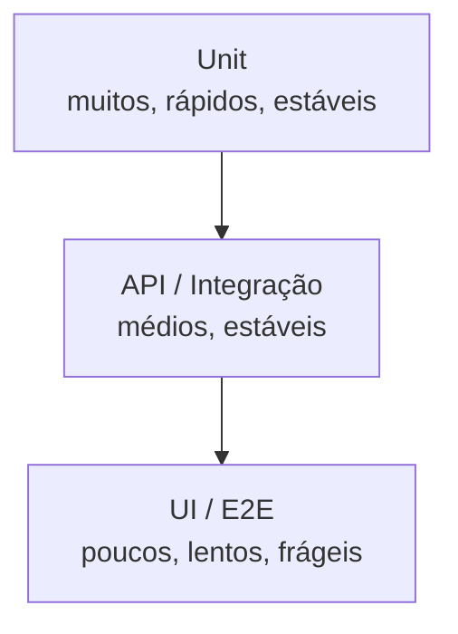

# Módulo 05: Testes Automatizados

## 5.1 Quando Automatizar?

Automatizar tudo é caro e ineficiente. Automatize:
- **Regressão** (executa sempre)
- **Smoke tests** (validação rápida)
- **Data-driven** (muitas combinações)
- **Performance/Carga** (impossível manual em escala)

Não automatize:
- Testes de usabilidade pura
- Features muito voláteis (custo de manutenção > benefício)
- Exploratório (use-o para *encontrar* o que vale a pena automatizar)

## 5.2 Pirâmide de Teste (Mike Cohn)



Regra: mais testes na base (unidade), menos no topo (UI). Por quê? Testes de UI são lentos, caros e flaky; testes de unidade rodam em ms e isolam bem as causas.

## 5.3 Padrão Page Object Model (POM)

Separa a lógica de interação da página dos testes. Benefícios: manutenção fácil, reuso, legibilidade.

```python
# pages/login_page.py
from playwright.sync_api import Page

class LoginPage:
    def __init__(self, page: Page):
        self.page = page
        self.email = page.get_by_test_id("email")
        self.senha = page.get_by_test_id("senha")
        self.entrar = page.get_by_test_id("entrar")

    def fazer_login(self, usuario: str, senha: str):
        self.email.fill(usuario)
        self.senha.fill(senha)
        self.entrar.click()
```

> Seletores por `data-testid` são estáveis: não quebram quando o layout muda.

## 5.4 Exemplo Real e Executável (Playwright + Pytest)

Os scripts deste módulo são **rodáveis de verdade**. Estrutura em `05/scripts/`:

```
05/scripts/
├── login.html              # página de login (demonstração offline)
├── conftest.py             # fixture `page` + path
├── pages/login_page.py     # Page Object
└── tests/test_login.py     # testes (básicos + data-driven)
```

Pré-requisitos e execução:
```bash
cd 05/scripts
pip install playwright && playwright install chromium
pytest          # 6 testes passam
```

Trecho do `tests/test_login.py`:
```python
def test_login_sucesso(login):
    login.fazer_login("user@teste.com", "Senha123")
    assert login.dashboard_visivel

def test_login_senha_invalida(login):
    login.fazer_login("user@teste.com", "errada")
    assert login.mensagem_erro_visivel
```

## 5.5 Data-Driven com `parametrize`

Em vez de copiar testes, parametrize combinações:

```python
import pytest

@pytest.mark.parametrize("usuario, senha, deve_logar", [
    ("user@teste.com", "Senha123", True),
    ("user@teste.com", "123", False),
    ("naoexiste@x.com", "Senha123", False),
    ("", "", False),
])
def test_login_parametrizado(login, usuario, senha, deve_logar):
    login.fazer_login(usuario, senha)
    assert login.dashboard_visivel is deve_logar
```

## 5.6 Dados de Teste com Faker

```python
from faker import Faker
fake = Faker("pt_BR")
print(fake.name(), fake.cpf(), fake.email())
# Saída: João Silva 123.456.789-00 joao.silva@exemplo.com
```

## 5.7 Boas Práticas

- **Não use `time.sleep`** — o Playwright já faz *auto-wait*; use `expect()` do `playwright` para condições.
- **Seletores estáveis**: `data-testid` ou IDs; evite XPath frágil baseado em layout.
- **Padrão AAA**: *Arrange, Act, Assert* — separe preparação, ação e verificação.
- **Independência**: cada teste roda isolado (sem ordem, sem estado compartilhado).
- **Combata flakiness**: retries, esperas explícitas, ambiente estável; investigue testes intermitentes.
- **Relatórios**: Allure ou `pytest-html` para evidência.
- **Versionar**: testes no mesmo repo da aplicação ou repo dedicado.

## 5.8 Execução em CI

```yaml
# .github/workflows/ci.yml (resumo)
- run: pip install playwright && playwright install chromium
- run: pytest 05/scripts --alluredir=reports/allure
- uses: actions/upload-artifact@v4
  with:
    name: allure-report
    path: reports/allure
```

> Dica: use `pytest-rerunfailures` (`--reruns 2`) para reduzir falsos negativos em E2E.

## 5.9 Citações e Referências

- **Cohn, M. (2009)** — "Succeeding with Agile" (Test Pyramid)
- **Martin, R. (2016)** — "Clean Architecture" (POM concept)
- **Playwright Docs** — https://playwright.dev/python/
- **ISTQB®** — "Test Automation" syllabus

---

## 5.10 Próximos Passos

Ao final deste módulo, o leitor deverá:
1. Explicar a pirâmide de teste
2. Implementar Page Objects com seletores estáveis
3. Escrever e **rodar** um teste de UI com Playwright
4. Aplicar data-driven com `parametrize`
5. Configurar testes em pipeline CI

---

> **Próximo módulo**: [Módulo 06: Testes de API](06/PT/indice.md)
