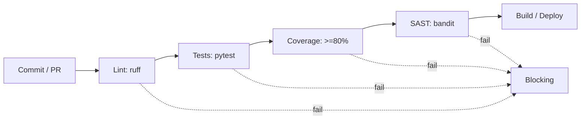

# Module 08: Code Quality and CI/CD

## 8.1 Code Quality

Quality isn't just "it works". It involves:
- **Readability** (Clean Code)
- **Test coverage** (coverage)
- **No vulnerabilities** (SAST)
- **Standardization** (linters, formatters)

Python tools:
- **pytest-cov** (coverage)
- **flake8 / ruff** (lint)
- **black** (formatting)
- **bandit** (static security)

## 8.2 Example: Coverage with pytest-cov

```bash
pytest --cov=src --cov-report=term-missing --cov-report=html
```

Output:
```
Name        Stmts   Miss  Cover
src/app.py     40      4    90%
```

## 8.3 CI/CD Pipeline (GitHub Actions)

Goal: every commit runs lint + tests + coverage + build.

File: `.github/workflows/ci.yml` (summary in `08/scripts/ci.yml`)

```yaml
name: CI
on: [push, pull_request]
jobs:
  test:
    runs-on: ubuntu-latest
    steps:
      - uses: actions/checkout@v4
      - uses: actions/setup-python@v5
        with: { python-version: "3.12" }
      - run: pip install -r requirements.txt
      - run: ruff check .
      - run: pytest --cov=src --cov-fail-under=80
```

### 8.3.1 Pipeline Diagram



## 8.4 Quality Gates

| Gate | Rule | Fails if |
|------|------|----------|
| Lint | no errors | ruff reports error |
| Coverage | ≥ 80% | below threshold |
| Security | 0 high | bandit finds vuln |
| Tests | 100% pass | any failure |

### 8.4.1 Reproducible gate (script)

Instead of checking manually, automate the decision. The script `08/scripts/quality_gate.py` implements the logic:
```python
def evaluate(lint_errors, coverage_pct, high_vulns, threshold=80):
    r = {
        "lint": "PASS" if lint_errors == 0 else "FAIL",
        "coverage": "PASS" if coverage_pct >= threshold else "FAIL",
        "security": "PASS" if high_vulns == 0 else "FAIL",
    }
    r["overall"] = "PASS" if all(v == "PASS" for v in r.values()) else "FAIL"
    return r
```

## 8.5 Shift-Left and Culture

- **Shift-Left**: test early in the cycle (not just at the end)
- **Definition of Done** includes tests
- **Code Review** mandatory (PR)
- **Trunk-based** or feature branch with CI

## 8.6 SAST and Security in CI

```bash
bandit -r src/ -f json -o bandit.json
```

Integrate in CI to block commits with secrets or SQL injection.

## 8.7 Best Practices

- Fail fast (stop at first error with `--maxfail=1`)
- Dependency cache (actions/cache)
- Coverage reports as artifacts
- Status badges in README

## 8.8 Citations and References

- **Martin, R. (2008)** — "Clean Code"
- **Humphrey, W. (1995)** — "A Discipline for Software Engineering" (PSP)
- **GitHub Actions Docs** — https://docs.github.com/actions
- **OWASP** — https://owasp.org (SAST, bandit)

---

## 8.9 Next Steps

At the end of this module, the reader should be able to:
1. Configure lint + coverage
2. Write a complete CI pipeline
3. Define quality gates
4. Integrate SAST (bandit)
5. Apply shift-left in routine

---

> **Next module**: [Module 09: Quality Management and Processes](09/EN/index.md)