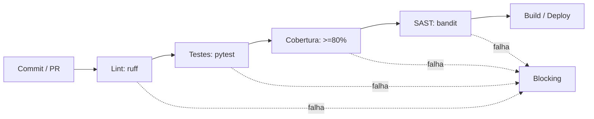

# Módulo 08: Qualidade de Código e CI/CD

## 8.1 Qualidade de Código

Qualidade não é só "funciona". Envolve:
- **Legibilidade** (Clean Code)
- **Cobertura de testes** (coverage)
- **Ausência de vulnerabilidades** (SAST)
- **Padronização** (linters, formatters)

Ferramentas Python:
- **pytest-cov** (cobertura)
- **flake8 / ruff** (lint)
- **black** (formatação)
- **bandit** (segurança estática)

## 8.2 Exemplo: Cobertura com pytest-cov

```bash
pytest --cov=src --cov-report=term-missing --cov-report=html
```

Saída:
```
Name        Stmts   Miss  Cover
src/app.py     40      4    90%
```

## 8.3 Pipeline CI/CD (GitHub Actions)

Objetivo: todo commit roda lint + testes + cobertura + build.

Arquivo: `.github/workflows/ci.yml` (resumo presente em `08/scripts/ci.yml`)

```yaml
name: CI
on: [push, pull_request]
jobs:
  test:
    runs-on: ubuntu-latest
    steps:
      - uses: actions/checkout@v4
      - uses: actions/setup-python@v5
        with: { python-version: "3.12" }
      - run: pip install -r requirements.txt
      - run: ruff check .
      - run: pytest --cov=src --cov-fail-under=80
```

### 8.3.1 Diagrama do Pipeline



## 8.4 Quality Gates (Portões de Qualidade)

| Gate | Regra | Falha se |
|------|-------|----------|
| Lint | sem erros | ruff reporta erro |
| Coverage | ≥ 80% | abaixo do limite |
| Security | 0 high | bandit acha vulnerabilidade |
| Tests | 100% pass | qualquer falha |

### 8.4.1 Gate reproduzível (script)

Em vez de checar manualmente, automatize a decisão. O script `08/scripts/quality_gate.py` implementa a lógica:
```python
def evaluate(lint_errors, coverage_pct, high_vulns, threshold=80):
    r = {
        "lint": "PASS" if lint_errors == 0 else "FAIL",
        "coverage": "PASS" if coverage_pct >= threshold else "FAIL",
        "security": "PASS" if high_vulns == 0 else "FAIL",
    }
    r["overall"] = "PASS" if all(v == "PASS" for v in r.values()) else "FAIL"
    return r
```

## 8.5 Shift-Left e Cultura

- **Shift-Left**: testar cedo no ciclo (não só no fim)
- **Definition of Done** inclui testes
- **Code Review** obrigatório (PR)
- **Trunk-based** ou feature branch com CI

## 8.6 SAST e Segurança em CI

```bash
bandit -r src/ -f json -o bandit.json
```

Integre no CI para bloquear commits com segredos ou SQL injection.

## 8.7 Boas Práticas

- Fail fast (pare no primeiro erro com `--maxfail=1`)
- Cache de dependências (actions/cache)
- Relatórios de cobertura como artefato
- Status badges no README

## 8.8 Citações e Referências

- **Martin, R. (2008)** — "Clean Code"
- **Humphrey, W. (1995)** — "A Discipline for Software Engineering" (PSP)
- **GitHub Actions Docs** — https://docs.github.com/actions
- **OWASP** — https://owasp.org (SAST, bandit)

---

## 8.9 Próximos Passos

Ao final deste módulo, o leitor deverá:
1. Configurar lint + coverage
2. Escrever um pipeline CI completo
3. Definir quality gates
4. Integrar SAST (bandit)
5. Aplicar shift-left na rotina

---

> **Próximo módulo**: [Módulo 09: Gestão de Qualidade e Processos](09/EN/index.md)