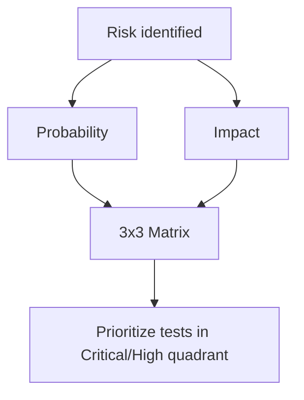
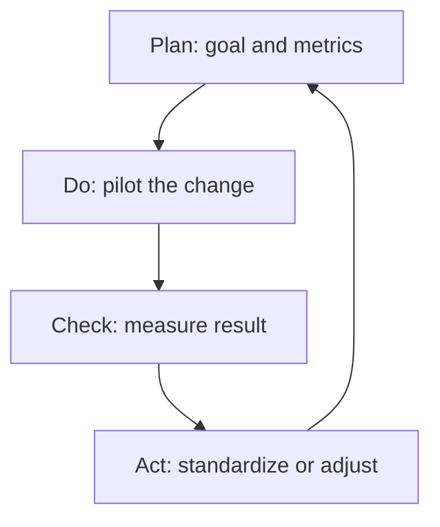

# Module 09: Quality Management and Processes

## 9.1 Maturity Models

| Model | Focus |
|-------|-------|
| **TMMi** | Test maturity (5 levels) |
| **CMMI** | Software process maturity |
| **ISO/IEC 25010** | Product quality (quality model) |
| **ISO 9001** | Organizational quality management |

### 9.1.1 TMMi Levels (Test Maturity Model integration)

1. **Level 1 — Initial**: ad-hoc, chaotic testing
2. **Level 2 — Managed**: phase-defined testing, managed environment
3. **Level 3 — Defined**: standardized test process integrated into the lifecycle
4. **Level 4 — Measured & Managed**: quantified quality metrics
5. **Level 5 — Optimized**: data-driven continuous improvement

## 9.2 ISO/IEC 25010 — Quality Model

8 characteristics:
1. Functional suitability
2. Performance efficiency
3. Compatibility
4. Usability
5. Reliability
6. Security
7. Maintainability
8. Portability

## 9.3 Quality Metrics (KPIs)

- **Defect Density**: defects / KLOC or per feature
- **Defect Leakage**: defects that reached production
- **Test Coverage**: tested requirements / total
- **MTTR**: mean time to repair
- **Escaped Defects**: defects found by customer

Example:
```
Defect Density = 5 defects / 1000 LOC = 0.005
Defect Leakage = prod defects / total = 10%
```

### 9.3.1 Worked KPI example

| Metric | Formula | Value (release X) |
|--------|---------|------------------|
| Defect Density | 12 defects / 2 KLOC | 6.0 / KLOC |
| Defect Leakage | 2 in prod / 20 total | 10% |
| Coverage | 48 req tested / 50 | 96% |
| MTTR | sum(fix hours) / #defects | 4.5 h |

The script `09/scripts/kpi.py` computes this reproducibly.

## 9.4 QA Risk Management

Identify risks and prioritize tests:
- **Probability × Impact** → risk matrix
- Risk-Based Testing (prioritize by risk)

| Impact \ Prob. | Low | Medium | High |
|----------------|-----|--------|------|
| **High** | Medium | High | **Critical** |
| **Medium** | Low | Medium | High |
| **Low** | Low | Low | Medium |



## 9.5 Agile Processes and QA

- **Scrum**: QA in team, DoD includes testing
- **Kanban**: WIP limits, continuous flow
- **BDD** (Cucumber): executable specification

BDD example (Gherkin):
```gherkin
Feature: Login
  Scenario: Valid user accesses
    Given a registered user
    When they log in with valid credentials
    Then they are redirected to the dashboard
```

## 9.6 Audit and Compliance

- **Traceability Matrix**: requirement ↔ test ↔ result
- **LGPD/GDPR**: anonymized test data
- **Compliance audit**: ISO, SOC2

## 9.7 Quality Culture

- Quality is **everyone's** responsibility, not just QA
- **Blameless post-mortem** for incidents
- **Continuous Improvement** (PDCA)



## 9.8 Citations and References

- **ISO/IEC 25010 (2023)** — System/Software Quality Model
- **TMMi Foundation** — https://www.tmmi.org/
- **Crispin, L. & Gregory, J. (2009)** — "Agile Testing"
- **CMMI Institute** — https://cmmiinstitute.com/

---

## 9.9 Next Steps

At the end of this module, the reader should be able to:
1. Explain TMMi and ISO 25010
2. Calculate quality KPIs
3. Apply Risk-Based Testing
4. Write BDD scenarios
5. Build a traceability matrix

---

> **Next module**: [Module 10: Templates and Appendices](10/EN/index.md)