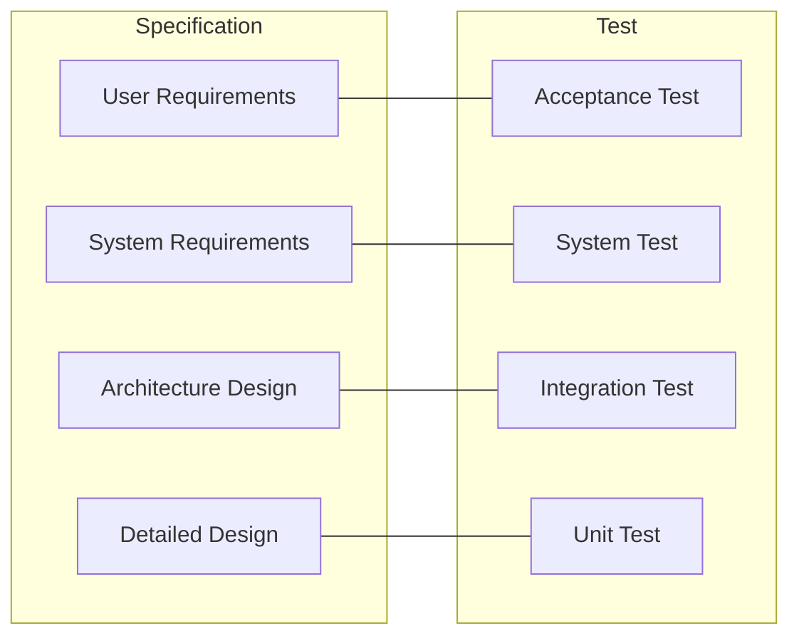

# Module 02: Software Quality Fundamentals

## 2.1 What is Software Quality?

Software quality is not just "absence of bugs." According to **ISO 9000**, quality is "the degree to which a set of inherent characteristics fulfills requirements." For software, this means meeting both functional requirements (what the system must do) and non-functional requirements (how it should behave).

### Quality Perspectives
- **Conformance**: meets documented specifications
- **Fitness for Use**: meets the real needs of the user
- **Process Quality**: quality of the development process (which leads to product quality — **Deming's** principle)

> *"You cannot inspect quality into a product. If it isn't already there, it's too late."* — **Harold Dodge**

## 2.2 Quality Models

### ISO/IEC 25010 (replaces ISO 9126)
Software product quality model with 8 characteristics:
1. **Functional Suitability** (completeness, correctness, appropriateness)
2. **Performance Efficiency** (time behavior, resource utilization, capacity)
3. **Compatibility** (co-existence, interoperability)
4. **Usability** (appropriateness recognizability, learnability, operability, user error protection, UI aesthetics, accessibility)
5. **Reliability** (maturity, availability, fault tolerance, recoverability)
6. **Security** (confidentiality, integrity, non-repudiation, authenticity, accountability)
7. **Maintainability** (modularity, reusability, analyzability, modifiability, testability)
8. **Portability** (adaptability, installability, replaceability)

### Boehm (1976) — Hierarchical Model
First quality model, structured as a tree:
- **Utility** and **Maintainability** at the top
- Branching into: portability, reliability, efficiency, testability, etc.

### McCall (1977) — Product Quality Model
11 factors grouped in 3 perspectives:
- **Product Operation** (correctness, reliability, efficiency, integrity, usability)
- **Product Revision** (maintainability, testability, flexibility)
- **Product Transition** (portability, reusability, interoperability)

## 2.3 Testing Principles (ISTQB)

> The 7 principles are detailed in **Module 01 (section 1.4)**. Summarized here for reference in this fundamentals module:

1. **Testing shows the presence of defects, not their absence**
2. **Exhaustive testing is impossible** — use risk analysis to prioritize
3. **Early testing** — the earlier a defect is found, the cheaper to fix
4. **Defect clustering (Pareto)** — few modules hold most bugs
5. **Pesticide paradox** — review and diversify test cases
6. **Testing is context dependent** — medical ≠ blog
7. **Absence-of-errors fallacy** — bug-free software can still fail the user

## 2.4 Test Levels

| Level | Objective | Responsible | Environment |
|-------|-----------|-------------|-------------|
| **Unit** | validate smallest testable part | Developer | Dev local |
| **Integration** | interfaces between modules | Developer/QA | Dev/CI |
| **System** | complete system behavior | QA | Staging |
| **Acceptance (UAT)** | meets the business | Client/PO | Pre-prod |

### Maintenance Tests
- **Smoke test**: shallow validation "did the system break?"
- **Regression test**: ensures changes didn't break existing functionality

## 2.5 V-Model

The V-Model links each definition phase (left) to a test phase (right). Each specification level has its corresponding verification; the **early testing** principle is central here.

## 2.6 Risk-Based Testing

Prioritize tests by **impact** (severity if it fails) × **probability** (chance of failing).

| Impact \ Probability | Low | Medium | High |
|----------------------|------|--------|------|
| **High** | Medium | High | **Critical** |
| **Medium** | Low | Medium | High |
| **Low** | Low | Low | Medium |

**Prioritization matrix**: test the Critical quadrant first (high impact, high probability).

> Practical example: in e-commerce, the "checkout" flow has high impact (revenue) and high probability (complex) → maximum priority.

## 2.7 Traceability Matrix (Requirements ↔ Tests)

Ensures each requirement has at least one test and vice versa (avoids "orphan tests" and "uncovered requirements").

| Req ID | Requirement | Test ID | Status | Result |
|--------|-------------|---------|--------|--------|
| REQ-01 | Login with valid email | TC-101, TC-102 | Done | Pass |
| REQ-02 | Block 3 attempts | TC-103 | Done | Pass |
| REQ-03 | Password recovery | TC-104 | To Do | — |

Tools: Jira + Xray, TestRail, Spreadsheets.

## 2.8 Test Types x ISO 25010 Model

| ISO 25010 Characteristic | Related Test Type |
|--------------------------|------------------|
| Functional Suitability | Functional Testing |
| Performance Efficiency | Performance/Load Testing |
| Usability | Usability/Heuristics Testing |
| Reliability | Stability Testing |
| Security | Security Testing (pentest) |
| Compatibility | Compatibility Testing |
| Maintainability | Mutation Testing, Reviews |
| Portability | Installation/Migration Testing |

### 2.8.1 Practical example: quality attribute scenario (SEI)

Quality attributes (ISO 25010) are only useful if **measurable**. Use the *stimulus → response* format (SEI):

**Performance Efficiency scenario**
- **Source**: 500 concurrent users (Black Friday peak)
- **Stimulus**: checkout request sent
- **Environment**: production, 4 replicas
- **Response**: 95% of requests answered in **< 800 ms**
- **Measure**: p95 < 800 ms with error rate < 1% (see Module 07)

**Reliability scenario**
- **Stimulus**: 1 replica fails
- **Response**: traffic rerouted, zero downtime
- **Measure**: availability ≥ 99.9% (three nines)

> Rule: every non-functional requirement must have a **number**; otherwise it's an opinion, not a requirement.

## 2.9 Test Lifecycle (ISTQB)

1. **Planning and Control**
2. **Analysis and Design**
3. **Implementation and Execution**
4. **Evaluating Exit Criteria**
5. **Test Closure**

## 2.10 Citations and References

- **ISO/IEC 25010:2023** — Systems and software engineering — Systems and software Quality Requirements and Evaluation (SQuaRE)
- **ISO/IEC/IEEE 29119** — Software Testing standard (international)
- **ISTQB® Glossary of Testing Terms** (v4.0)
- **Boehm, B. (1976)** — "Software Engineering" — first quality taxonomy
- **McCall, J. (1977)** — "Factors in Software Quality" (RADC)
- **Myers, G. (1979)** — "The Art of Software Testing" — testing principles
- **Deming, W. E.** — "Out of the Crisis" — process quality

---

## 2.11 Next Steps

At the end of this module, the reader should be able to:
1. Explain quality under conformance and fitness-for-use perspectives
2. List the 8 characteristics of ISO 25010
3. Apply the 7 ISTQB testing principles
4. Build a simple traceability matrix
5. Prioritize tests using the risk matrix

---

> **Next module**: [Module 03: Test Planning](../03/EN/index.md)
