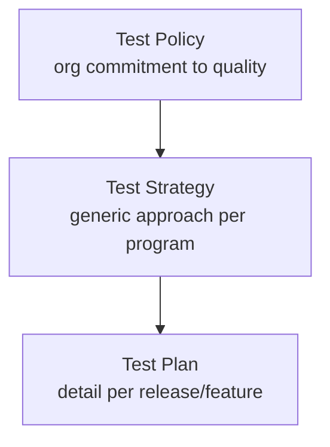

# Module 03: Test Planning

## 3.1 Why plan?

Testing without planning is like building without a blueprint: wasted resources and risk of omitting critical points. Planning aligns the team, defines scope, estimates effort, and establishes success criteria.

> *"Plans are worthless, but planning is everything."* — **Dwight D. Eisenhower**

## 3.2 Test Policy, Strategy and Plan

### Test Policy
High-level organizational document declaring the commitment to quality. Rare in small companies, common in large corporations.

### Test Strategy
Program/project level: addresses test approach, levels, types, environments, tools, and responsibilities generically (not per release).

### Test Plan
Project/feature level: details WHAT will be tested, HOW, BY WHOM, WHEN, and with what resources for a specific iteration.

| Aspect | Strategy | Plan |
|--------|----------|------|
| Scope | Organizational/Program | Release/Project |
| Frequency | Stable | Per iteration |
| Detail | Generic | Specific |



## 3.3 Planning Inputs and Outputs (ISTQB)

**Inputs**:
- Requirements / user stories documents
- Architecture and design
- Project risks
- Organizational test strategy
- Constraints (time, budget, people)

**Outputs**:
- Approved Test Plan
- Test cases / charters
- Test environment configured
- Test data prepared
- Entry and exit criteria defined

## 3.4 Test Effort Estimation

Common methods:
- **Similarity/Ratio**: % of development effort (e.g., 30-50%)
- **3-Point Estimation**: (Optimistic + 4×Realistic + Pessimistic) / 6
- **By Complexity**: score features and multiply by test factor

Example 3-point for a feature:
```
Ot = 3d, Rl = 5d, Ps = 10d
Estimation = (3 + 4×5 + 10) / 6 = 5.5 days
```

### 3.4.1 Worked example (multiple features)

| Feature | Ot (d) | Rl (d) | Ps (d) | PERT (d) |
|---------|--------|--------|--------|----------|
| Login | 1 | 2 | 4 | 2.17 |
| Checkout | 3 | 5 | 10 | 5.50 |
| Reports | 2 | 4 | 9 | 4.50 |
| **Total** | | | | **12.17** |

The script `docs/03/scripts/estimate.py` computes this reproducibly:
```python
def pert(o, r, p):
    return (o + 4 * r + p) / 6

features = {"Login": (1, 2, 4), "Checkout": (3, 5, 10), "Reports": (2, 4, 9)}
total = sum(pert(*v) for v in features.values())
print(f"Total PERT: {total:.2f} days")  # 11.83
```

## 3.5 Test Environments

- **Dev**: local development
- **CI/CD**: automatic execution in pipeline
- **Staging (Homologation)**: mirror of production for UAT
- **Performance**: dedicated environment for load
- **Production (canary)**: controlled validation in a small slice

Environment checklist:
- [ ] Anonymized/mocked data
- [ ] Access and credentials documented
- [ ] Application version equal to tested build
- [ ] Logs and monitoring enabled

## 3.6 Test Data

Strategies:
- **Anonymized production**: careful with LGPD/GDPR
- **Generated (Faker)**: `faker.Faker("en_US")` for SSN, names, addresses
- **Synthetic**: created to cover boundaries

Python example:
```python
from faker import Faker
fake = Faker("en_US")
print(fake.ssn(), fake.name(), fake.email())
```

## 3.7 Entry and Exit Criteria

**Entry** (when to start testing):
- Build available and installable
- Environment ready
- Test cases reviewed

**Exit** (when to stop):
- % of cases executed (e.g., 100%)
- % of success (e.g., ≥ 95%)
- Critical/high defects = 0 open
- Minimum code coverage (e.g., 80%)

## 3.8 Coverage Metrics

- **Requirement coverage**: requirements with ≥1 test / total
- **Code coverage**: lines/branches executed by tests
- **Risk coverage**: high-risk requirements tested / total high-risk

| Metric | Target | Tool |
|--------|--------|------|
| Requirements | 100% | Traceability matrix |
| Code | ≥ 80% | coverage.py, JaCoCo |
| Open defects (critical) | 0 | Jira |

## 3.9 Test Plan Template (summary)

1. **Introduction / Objective**
2. **Test Items** (scope)
3. **Out of Scope** (what will not be tested)
4. **Approach** (levels, types)
5. **Environment and data**
6. **Schedule and responsibilities**
7. **Risks and mitigations**
8. **Entry/exit criteria**
9. **Approvals**

> Full template available at `10/EN/test_plan_template.md`.

### 3.9.1 Mini Test Plan (concrete example)

| Section | Content (Release 2.3 — Checkout) |
|---------|---------------------------------|
| Objective | Validate new PIX payment flow |
| Scope | Checkout screen, gateway integration, confirmation email |
| Out of scope | Financial reports (other squad) |
| Approach | API (90%) + critical E2E (10%) |
| Environment | Staging v2.3, anonymized Faker data |
| Schedule | Sep 5–9 — QA: Ana |
| Risks | Unstable gateway → mitigation: mock |
| Entry | Build 2.3 OK, env ready |
| Exit | 100% executed, ≥95% pass, 0 critical, cov ≥80% |

> Note how "Exit" uses measurable numbers — exit criteria must be objective.

## 3.10 Citations and References

- **ISO/IEC/IEEE 29119-1** — Test Planning
- **ISTQB® Foundation Level Syllabus** — "Test Planning" section
- **Black, R. (2009)** — "Managing the Testing Process"
- **Eisenhower, D. D.** — on planning

---

## 3.11 Next Steps

At the end of this module, the reader should be able to:
1. Differentiate Policy, Strategy, and Plan
2. Elaborate a basic Test Plan
3. Estimate effort using 3-point method
4. Define measurable exit criteria
5. Prepare test environments and data

---

> **Next module**: [Module 04: Manual and Exploratory Testing](../04/EN/index.md)
