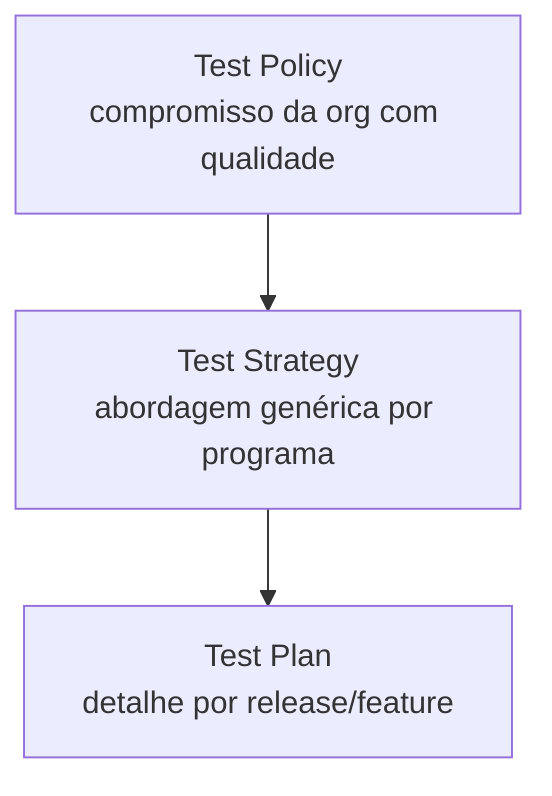

# Módulo 03: Planejamento de Testes

## 3.1 Por que planejar?

Testar sem planejamento é como construir sem planta: desperdício de recursos e risco de omitir pontos críticos. O planejamento alinha a equipe, define escopo, estima esforço e estabelece critérios de sucesso.

> *"Plans are worthless, but planning is everything."* — **Dwight D. Eisenhower**

## 3.2 Test Policy, Strategy e Plan

### Test Policy (Política de Teste)
Documento de alto nível da organização que declara o compromisso com a qualidade. Raro em pequenas empresas, comum em grandes corporações.

### Test Strategy (Estratégia de Teste)
Nível de programa/projeto: aborda abordagem de teste, níveis, tipos, ambientes, ferramentas e responsabilidades de forma genérica (não por release).

### Test Plan (Plano de Teste)
Nível de projeto/feature: detalha o QUE será testado, COMO, POR QUEM, QUANDO e com que recursos para uma iteração específica.

| Aspecto | Strategy | Plan |
|---------|----------|------|
| Escopo | Organizacional/Programa | Release/Projeto |
| Frequência | Estável | Por iteração |
| Detalhe | Genérico | Específico |



## 3.3 Entradas e Saídas do Planejamento (ISTQB)

**Entradas**:
- Documentos de requisitos / user stories
- Arquitetura e design
- Riscos do projeto
- Estratégia de teste organizacional
- Restrições (tempo, orçamento, pessoas)

**Saídas**:
- Test Plan aprovado
- Casos de teste / charters
- Ambiente de teste configurado
- Dados de teste preparados
- Critérios de entrada e saída definidos

## 3.4 Estimativa de Esforço de Teste

Métodos comuns:
- **Similaridade/Ratio**: % do esforço de desenvolvimento (ex: 30-50%)
- **Caixa de estimativa (3 pontos)**: Otimista + 4×Realista + Pessimista ÷ 6
- **Por complexidade**: pontuar features e multiplicar por fator de teste

Exemplo 3 pontos para uma feature:
```
Ot = 3d, Rl = 5d, Ps = 10d
Estimativa = (3 + 4×5 + 10) / 6 = 5,5 dias
```

### 3.4.1 Exemplo trabalhado (várias features)

| Feature | Ot (d) | Rl (d) | Ps (d) | PERT (d) |
|---------|--------|--------|--------|----------|
| Login | 1 | 2 | 4 | 2,17 |
| Checkout | 3 | 5 | 10 | 5,50 |
| Relatórios | 2 | 4 | 9 | 4,50 |
| **Total** | | | | **12,17** |

O script `docs/03/scripts/estimate.py` calcula isso de forma reproduzível:
```python
def pert(o, r, p):
    return (o + 4 * r + p) / 6

features = {"Login": (1, 2, 4), "Checkout": (3, 5, 10), "Relatórios": (2, 4, 9)}
total = sum(pert(*v) for v in features.values())
print(f"Total PERT: {total:.2f} dias")  # 11.83
```

## 3.5 Ambientes de Teste

- **Dev**: desenvolvimento local
- **CI/CD**: execução automática em pipeline
- **Homologação (Staging)**: espelho de produção para UAT
- **Performance**: ambiente dedicado para carga
- **Produção (canary)**: validação controlada em pequena fatia

Checklist de ambiente:
- [ ] Dados anonimizados/mockados
- [ ] Acessos e credenciais documentados
- [ ] Versão da aplicação igual à do build testado
- [ ] Logs e monitoramento habilitados

## 3.6 Dados de Teste

Estratégias:
- **Produção anonimizada**: cuidado com LGPD/GDPR
- **Gerados (Faker)**: `faker.Faker("pt_BR")` para CPF, nomes, endereços
- **Sintéticos**: criados para cobrir bordas (boundary values)

Exemplo Python:
```python
from faker import Faker
fake = Faker("pt_BR")
print(fake.cpf(), fake.name(), fake.email())
```

## 3.7 Critérios de Entrada e Saída (Exit Criteria)

**Entrada** (quando começar a testar):
- Build disponível e instalável
- Ambiente pronto
- Casos de teste revisados

**Saída** (quando parar):
- % de casos executados (ex: 100%)
- % de sucesso (ex: ≥ 95%)
- Defeitos críticos/altos = 0 abertos
- Cobertura de código mínima (ex: 80%)

## 3.8 Métricas de Cobertura

- **Cobertura de requisitos**: requisitos com ≥1 teste / total
- **Cobertura de código**: linhas/branches executadas por testes
- **Cobertura de risco**: requisitos de alto risco testados / total de alto risco

| Métrica | Alvo | Ferramenta |
|---------|------|-----------|
| Requisitos | 100% | Traceability matrix |
| Código | ≥ 80% | coverage.py, JaCoCo |
| Defeitos abertos (crítico) | 0 | Jira |

## 3.9 Template de Test Plan (resumo)

1. **Introdução / Objetivo**
2. **Itens de teste** (escopo)
3. **Não escopo** (o que não será testado)
4. **Abordagem** (níveis, tipos)
5. **Ambiente e dados**
6. **Cronograma e responsáveis**
7. **Riscos e mitigações**
8. **Critérios de entrada/saída**
9. **Aprovações**

> Template completo disponível em `10/PT/test_plan_template.md`.

### 3.9.1 Mini Test Plan (exemplo concreto)

| Seção | Conteúdo (Release 2.3 — Checkout) |
|-------|-----------------------------------|
| Objetivo | Validar novo fluxo de pagamento PIX |
| Escopo | Tela de checkout, integração com gateway, e-mail de confirmação |
| Fora de escopo | Relatórios financeiros (outro squad) |
| Abordagem | API (90%) + E2E crítico (10%) |
| Ambiente | Staging v2.3, dados Faker anonimizados |
| Cronograma | 05/set a 09/set — QA: Ana |
| Riscos | Gateway instável → mitigação: mock |
| Entrada | Build 2.3 OK, env pronto |
| Saída | 100% executados, ≥95% pass, 0 crítico, cov ≥80% |

> Note como "Saída" usa números mensuráveis — critério de saída deve ser objetivo.

## 3.10 Citações e Referências

- **ISO/IEC/IEEE 29119-1** — Test Planning
- **ISTQB® Foundation Level Syllabus** — seção "Test Planning"
- **Black, R. (2009)** — "Managing the Testing Process"
- **Eisenhower, D. D.** — sobre planejamento

---

## 3.11 Próximos Passos

Ao final deste módulo, o leitor deverá:
1. Diferenciar Policy, Strategy e Plan
2. Elaborar um Test Plan básico
3. Estimar esforço usando 3 pontos
4. Definir critérios de saída mensuráveis
5. Preparar ambientes e dados de teste

---

> **Próximo módulo**: [Módulo 04: Testes Manuais e Exploratórios](../04/PT/indice.md)
