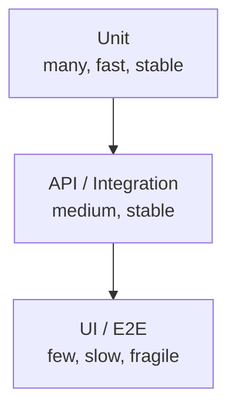

# Module 05: Automated Testing

## 5.1 When to Automate?

Automating everything is expensive and inefficient. Automate:
- **Regression** (runs always)
- **Smoke tests** (fast validation)
- **Data-driven** (many combinations)
- **Performance/Load** (impossible manually at scale)

Do NOT automate:
- Pure usability testing
- Very volatile features (maintenance cost > benefit)
- Exploratory (use it to *find* what's worth automating)

## 5.2 Test Pyramid (Mike Cohn)



Rule: more tests at the base (unit), fewer at the top (UI). Why? UI tests are slow, costly, and flaky; unit tests run in ms and isolate causes well.

## 5.3 Page Object Model (POM) Pattern

Separates page interaction logic from tests. Benefits: easy maintenance, reuse, readability.

```python
# pages/login_page.py
from playwright.sync_api import Page

class LoginPage:
    def __init__(self, page: Page):
        self.page = page
        self.email = page.get_by_test_id("email")
        self.senha = page.get_by_test_id("senha")
        self.entrar = page.get_by_test_id("entrar")

    def fazer_login(self, usuario: str, senha: str):
        self.email.fill(usuario)
        self.senha.fill(senha)
        self.entrar.click()
```

> `data-testid` selectors are stable: they don't break when layout changes.

## 5.4 Real and Runnable Example (Playwright + Pytest)

The scripts in this module are **genuinely runnable**. Structure in `docs/05/scripts/`:

```
docs/05/scripts/
├── login.html              # login page (offline demo)
├── conftest.py             # `page` fixture + path
├── pages/login_page.py     # Page Object
└── tests/test_login.py     # tests (basic + data-driven)
```

Prerequisites and execution:
```bash
cd 05/scripts
pip install playwright && playwright install chromium
pytest          # 6 tests pass
```

Snippet from `tests/test_login.py`:
```python
def test_login_sucesso(login):
    login.fazer_login("user@test.com", "Pass123")
    assert login.dashboard_visivel

def test_login_senha_invalida(login):
    login.fazer_login("user@test.com", "wrong")
    assert login.mensagem_erro_visivel
```

## 5.5 Data-Driven with `parametrize`

Instead of copying tests, parametrize combinations:

```python
import pytest

@pytest.mark.parametrize("usuario, senha, deve_logar", [
    ("user@test.com", "Pass123", True),
    ("user@test.com", "123", False),
    ("naoexiste@x.com", "Pass123", False),
    ("", "", False),
])
def test_login_parametrizado(login, usuario, senha, deve_logar):
    login.fazer_login(usuario, senha)
    assert login.dashboard_visivel is deve_logar
```

## 5.6 Test Data with Faker

```python
from faker import Faker
fake = Faker("en_US")
print(fake.name(), fake.ssn(), fake.email())
# Output: John Smith 123-45-6789 john.smith@example.com
```

## 5.7 Best Practices

- **Don't use `time.sleep`** — Playwright does *auto-wait*; use `expect()` for conditions.
- **Stable selectors**: `data-testid` or IDs; avoid fragile layout-based XPath.
- **AAA pattern**: *Arrange, Act, Assert* — separate setup, action, verification.
- **Independence**: each test runs in isolation (no order, no shared state).
- **Fight flakiness**: retries, explicit waits, stable env; investigate intermittent tests.
- **Reports**: Allure or `pytest-html` for evidence.
- **Versioning**: tests in same app repo or dedicated repo.

## 5.8 CI Execution

```yaml
# .github/workflows/ci.yml (summary)
- run: pip install playwright && playwright install chromium
- run: pytest 05/scripts --alluredir=reports/allure
- uses: actions/upload-artifact@v4
  with:
    name: allure-report
    path: reports/allure
```

> Tip: use `pytest-rerunfailures` (`--reruns 2`) to reduce false negatives in E2E.

## 5.9 Citations and References

- **Cohn, M. (2009)** — "Succeeding with Agile" (Test Pyramid)
- **Martin, R. (2016)** — "Clean Architecture" (POM concept)
- **Playwright Docs** — https://playwright.dev/python/
- **ISTQB®** — "Test Automation" syllabus

---

## 5.10 Next Steps

At the end of this module, the reader should be able to:
1. Explain the test pyramid
2. Implement Page Objects with stable selectors
3. Write and **run** a UI test with Playwright
4. Apply data-driven with `parametrize`
5. Configure tests in CI pipeline

---

> **Next module**: [Module 06: API Testing](../06/EN/index.md)

