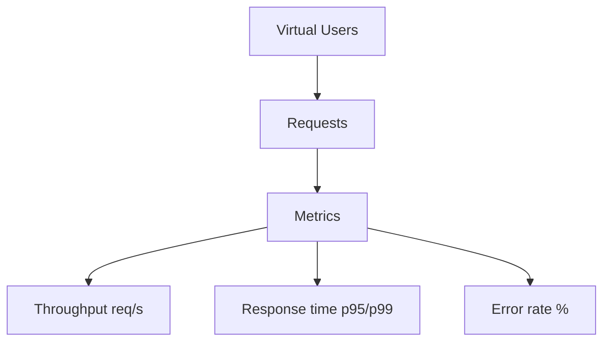

# Module 07: Performance and Load Testing

## 7.1 Fundamental Concepts

| Term | Definition |
|------|------------|
| **Load** | Expected volume of users/transactions |
| **Stress** | Beyond capacity to find the limit |
| **Spike** | Sudden load increase |
| **Endurance** | Sustained load over long time (memory leak) |
| **Scalability** | Behavior when increasing resources |

Key metrics:
- **Throughput** (req/s)
- **Response time** (average, p95, p99)
- **Error rate** (% of failures)
- **Concurrency** (simultaneous users)



## 7.2 Tools

- **Locust** (Python, code-as-test)
- **k6** (JavaScript, modern, CI-friendly)
- **JMeter** (Java, GUI, robust)
- **Gatling** (Scala, high performance)

## 7.3 Real Example: Locust (Python)

File: `docs/07/scripts/locustfile.py`

```python
from locust import HttpUser, task, between

class StoreUser(HttpUser):
    wait_time = between(1, 3)

    @task(3)
    def view_product(self):
        self.client.get("/products/1")

    @task(1)
    def buy(self):
        self.client.post("/checkout", json={"item": 1, "qty": 2})
```

Execution:
```bash
locust -f locustfile.py --headless -u 100 -r 10 -t 1m
# 100 users, ramp-up 10/s, lasting 1 minute
```

## 7.4 Real Example: k6 (JavaScript)

File: `docs/07/scripts/script.js`

```javascript
import http from 'k6/http';
import { check, sleep } from 'k6';

export const options = {
  vus: 50,
  duration: '30s',
  thresholds: {
    http_req_duration: ['p(95)<500'],
    http_req_failed: ['rate<0.01'],
  },
};

export default function () {
  const res = http.get('https://test.k6.io');
  check(res, { 'status 200': (r) => r.status === 200 });
  sleep(1);
}
```

Execution: `k6 run script.js`

> The Locust/k6 examples need those tools installed. To test **offline**, use `docs/07/scripts/target_server.py` (stdlib server) as the target:
> ```bash
> python docs/07/scripts/target_server.py &   # serves on :8080
> locust -f docs/07/scripts/locustfile.py --headless -u 50 -r 5 -t 30s -H http://127.0.0.1:8080
> ```

## 7.5 Understanding and Computing Percentiles (p95/p99)

Percentiles mean: "95% of requests were faster than X". Unlike the average, they **don't hide the long tail**.

Example with 10 response times (ms): `100, 120, 130, 140, 150, 160, 170, 180, 190, 1000`
- Average = 234 ms (skewed by the outlier)
- **p95 = 1000 ms** (the worst case dominates) → investigate the tail

The script `docs/07/scripts/percentile.py` computes this reproducibly:
```python
times = [100,120,130,140,150,160,170,180,190,1000]
percentile(times, 95)   # 1000.0  (nearest-rank)
```

## 7.6 Result Analysis

When reviewing results, look for:
- **High p95/p99** → bottleneck (DB, network, code)
- **Growing error rate** → resource saturation
- **Stagnant throughput** → system limit
- **Rising memory** (endurance) → memory leak

## 7.7 Best Practices

- Performance environment **isolated and dedicated**
- **Realistic** test data (volume close to production)
- Run at **low-usage hours** if using prod
- Document **baseline** for comparison
- Define **SLA** upfront (e.g., p95 < 800ms)

## 7.8 Citations and References

- **JMeter User Manual** — https://jmeter.apache.org/usermanual/
- **k6 Docs** — https://k6.io/docs/
- **Locust Docs** — https://docs.locust.dev/
- **Moliero, I. (2019)** — "Performance Testing Guidance" (MS patterns)

---

## 7.9 Next Steps

At the end of this module, the reader should be able to:
1. Differentiate load, stress, spike, endurance
2. Write a load test in Locust or k6
3. Define p95 SLA thresholds
4. Interpret throughput and error rate
5. Identify memory leak in endurance

---

> **Next module**: [Module 08: Code Quality and CI/CD](../08/EN/index.md)
