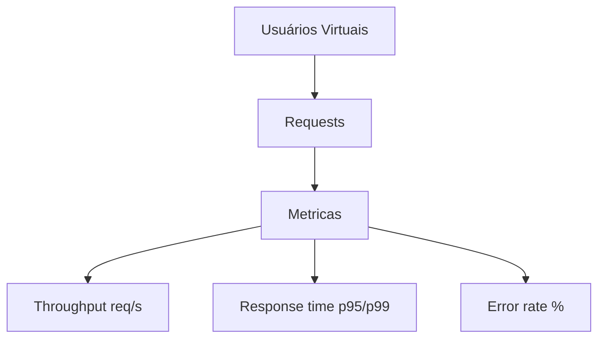

# Módulo 07: Testes de Performance e Carga

## 7.1 Conceitos Fundamentais

| Termo | Definição |
|-------|-----------|
| **Carga (Load)** | Volume esperado de usuários/transações |
| **Estresse (Stress)** | Além da capacidade para encontrar limite |
| **Pico (Spike)** | Aumento súbito de carga |
| **Resistência (Endurance)** | Carga sustentada por longo tempo (vazamento de memória) |
| **Escalabilidade** | Comportamento ao aumentar recursos |

Métricas-chave:
- **Throughput** (req/s)
- **Response time** (média, p95, p99)
- **Error rate** (% de falhas)
- **Concurrency** (usuários simultâneos)



## 7.2 Ferramentas

- **Locust** (Python, código como teste)
- **k6** (JavaScript, moderno, CI-friendly)
- **JMeter** (Java, GUI, robusto)
- **Gatling** (Scala, alto desempenho)

## 7.3 Exemplo Real: Locust (Python)

Arquivo: `docs/07/scripts/locustfile.py`

```python
from locust import HttpUser, task, between

class LojaUser(HttpUser):
    wait_time = between(1, 3)

    @task(3)
    def ver_produto(self):
        self.client.get("/produtos/1")

    @task(1)
    def comprar(self):
        self.client.post("/checkout", json={"item": 1, "qtd": 2})
```

Execução:
```bash
locust -f locustfile.py --headless -u 100 -r 10 -t 1m
# 100 usuários, ramp-up 10/s, durando 1 minuto
```

## 7.4 Exemplo Real: k6 (JavaScript)

Arquivo: `docs/07/scripts/script.js`

```javascript
import http from 'k6/http';
import { check, sleep } from 'k6';

export const options = {
  vus: 50,
  duration: '30s',
  thresholds: {
    http_req_duration: ['p(95)<500'], // p95 < 500ms
    http_req_failed: ['rate<0.01'],   // < 1% falha
  },
};

export default function () {
  const res = http.get('https://test.k6.io');
  check(res, { 'status 200': (r) => r.status === 200 });
  sleep(1);
}
```

Execução: `k6 run script.js`

> Os exemplos de Locust/k6 precisam das ferramentas instaladas. Para testar **offline**, use `docs/07/scripts/target_server.py` (servidor stdlib) como alvo:
> ```bash
> python docs/07/scripts/target_server.py &   # sobe em :8080
> locust -f docs/07/scripts/locustfile.py --headless -u 50 -r 5 -t 30s -H http://127.0.0.1:8080
> ```

## 7.5 Entendendo e Calculando Percentis (p95/p99)

Percentis dizem: "95% das requisições foram mais rápidas que X". Diferente da média, **não escondem cauda longa**.

Exemplo com 10 tempos (ms): `100, 120, 130, 140, 150, 160, 170, 180, 190, 1000`
- Média = 234 ms (distorcida pelo outlier)
- **p95 = 1000 ms** (o pior caso domina) → investigar a cauda

!!! example "Script reproduzível"
    O script \$(System.Collections.Hashtable[1])\ calcula isso de forma reproduzível.
```python
tempos = [100,120,130,140,150,160,170,180,190,1000]
percentile(tempos, 95)   # 1000.0  (nearest-rank)
```

## 7.6 Análise de Resultados

Ao receber os resultados, procure:
- **p95/p99 alto** → gargalo (DB, rede, código)
- **Error rate crescente** → saturação de recursos
- **Throughput estagnado** → limite do sistema
- **Memória subindo** (endurance) → memory leak

## 7.7 Boas Práticas

- Ambiente de performance **isolado e dedicado**
- Dados de teste **realistas** (volume próximo de produção)
- Rode em **horário de baixo uso** se usar prod
- Documente **baseline** (linha de base) para comparação
- Defina **SLA** antes (ex: p95 < 800ms)

## 7.8 Citações e Referências

- **JMeter User Manual** — https://jmeter.apache.org/usermanual/
- **k6 Docs** — https://k6.io/docs/
- **Locust Docs** — https://docs.locust.dev/
- **Moliero, I. (2019)** — "Performance Testing Guidance" (MS patterns)

---

## 7.9 Próximos Passos

Ao final deste módulo, o leitor deverá:
1. Diferenciar carga, estresse, pico, endurance
2. Escrever um teste de carga em Locust ou k6
3. Definir thresholds (SLA) de p95
4. Interpretar throughput e error rate
5. Identificar memory leak em endurance

---

> **Próximo módulo**: [Módulo 08: Qualidade de Código e CI/CD](../08/EN/index.md)
