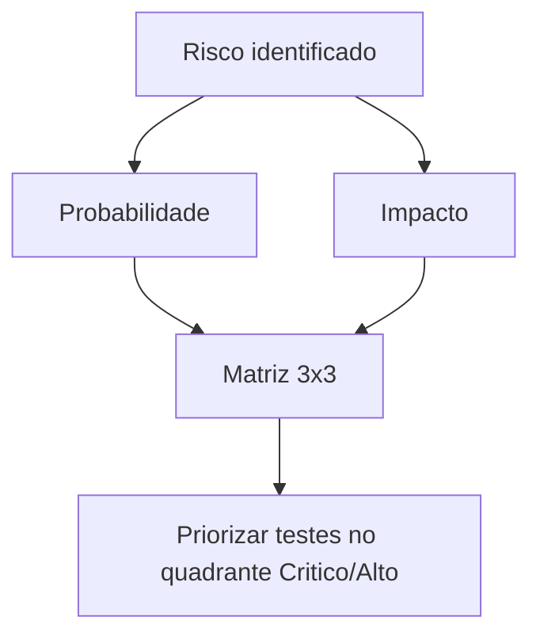
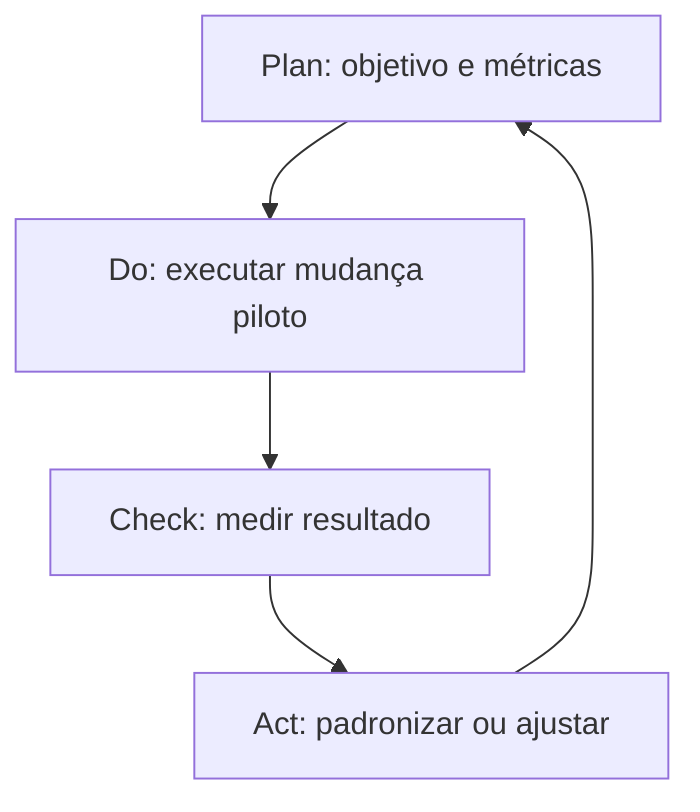

# Módulo 09: Gestão de Qualidade e Processos

## 9.1 Modelos de Maturidade

| Modelo | Foco |
|--------|------|
| **TMMi** | Maturidade de teste (5 níveis) |
| **CMMI** | Maturidade de processo de software |
| **ISO/IEC 25010** | Qualidade de produto (modelo de qualidade) |
| **ISO 9001** | Gestão da qualidade organizacional |

### 9.1.1 Níveis TMMi (Test Maturity Model integration)

1. **Nível 1 — Inicial**: testes ad-hoc, caóticos
2. **Nível 2 — Gerenciado**: testes definidos por fase, ambiente gerenciado
3. **Nível 3 — Definido**: processo de teste padronizado e integrado ao ciclo
4. **Nível 4 — Medido e Gerenciado**: métricas e qualidade quantificadas
5. **Nível 5 — Otimizado**: melhoria contínua baseada em dados

## 9.2 ISO/IEC 25010 — Modelo de Qualidade

8 características:
1. Adequação funcional
2. Eficiência de desempenho
3. Compatibilidade
4. Usabilidade
5. Confiabilidade
6. Segurança
7. Manutenibilidade
8. Portabilidade

## 9.3 Métricas de Qualidade (KPIs)

- **Defect Density**: defeitos / KLOC ou por feature
- **Defect Leakage**: defeitos que passaram para produção
- **Test Coverage**: requisitos testados / total
- **MTTR**: tempo médio de correção
- **Escaped Defects**: defeitos descobertos pelo cliente

Exemplo:
```
Defect Density = 5 defeitos / 1000 LOC = 0,005
Defect Leakage = defeitos em prod / total = 10%
```

### 9.3.1 Exemplo trabalhado de KPIs

| Métrica | Fórmula | Valor (release X) |
|---------|---------|------------------|
| Defect Density | 12 defeitos / 2 KLOC | 6,0 / KLOC |
| Defect Leakage | 2 em prod / 20 total | 10% |
| Cobertura | 48 req testadas / 50 | 96% |
| MTTR | soma(horas correção) / nº defeitos | 4,5 h |

O script `docs/09/scripts/kpi.py` calcula isso de forma reproduzível.

## 9.4 Gestão de Riscos em QA

Identificar riscos e priorizar testes:
- **Probabilidade × Impacto** → matriz de risco
- Testes priorizados por risco (Risk-Based Testing)

| Impacto \ Prob. | Baixa | Média | Alta |
|-----------------|-------|-------|------|
| **Alto** | Médio | Alto | **Crítico** |
| **Médio** | Baixo | Médio | Alto |
| **Baixo** | Baixo | Baixo | Médio |



## 9.5 Processos Ágeis e QA

- **Scrum**: QA no time, DoD inclui teste
- **Kanban**: limites WIP, fluxo contínuo
- **BDD** (Cucumber): especificação executável

Exemplo BDD (Gherkin):
```gherkin
Feature: Login
  Scenario: Usuário válido acessa
    Given um usuário cadastrado
    When ele faz login com credenciais válidas
    Then ele é redirecionado ao dashboard
```

## 9.6 Auditoria e Compliance

- **Traceability Matrix**: requisito ↔ teste ↔ resultado
- **LGPD/GDPR**: dados de teste anonimizados
- **Auditoria de conformidade**: ISO, SOC2

## 9.7 Cultura de Qualidade

- Qualidade é responsabilidade de **todos**, não só do QA
- **Blameless post-mortem** para incidentes
- **Continuous Improvement** (PDCA)



## 9.8 Citações e Referências

- **ISO/IEC 25010 (2023)** — System/Software Quality Model
- **TMMi Foundation** — https://www.tmmi.org/
- **Crispin, L. & Gregory, J. (2009)** — "Agile Testing"
- **CMMI Institute** — https://cmmiinstitute.com/

---

## 9.9 Próximos Passos

Ao final deste módulo, o leitor deverá:
1. Explicar TMMi e ISO 25010
2. Calcular KPIs de qualidade
3. Aplicar Risk-Based Testing
4. Escrever cenários BDD
5. Montar uma matriz de rastreabilidade

---

> **Próximo módulo**: [Módulo 10: Templates e Apêndices](../10/EN/index.md)
